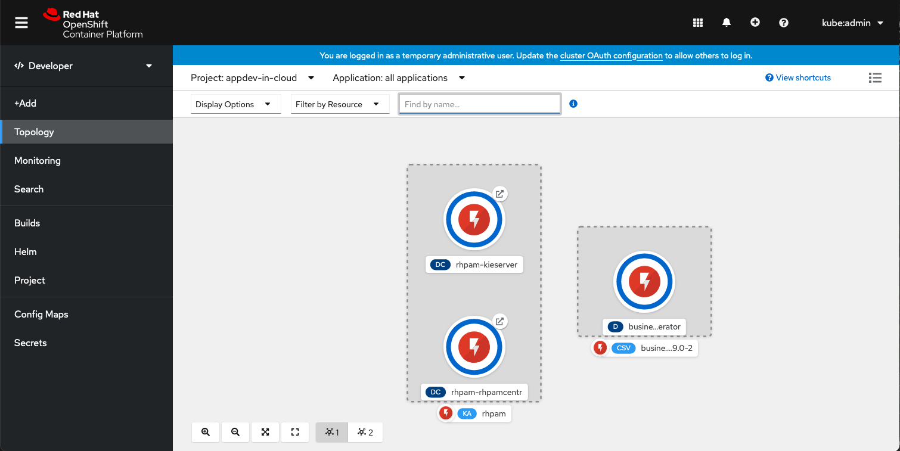
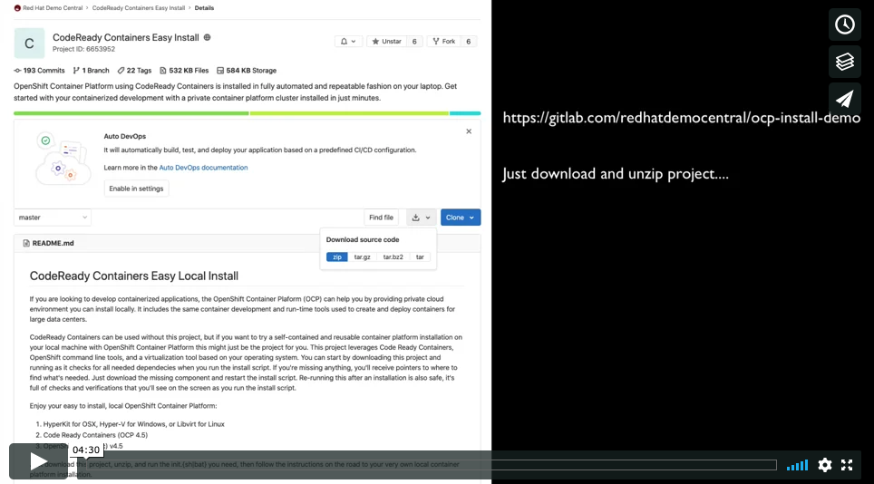
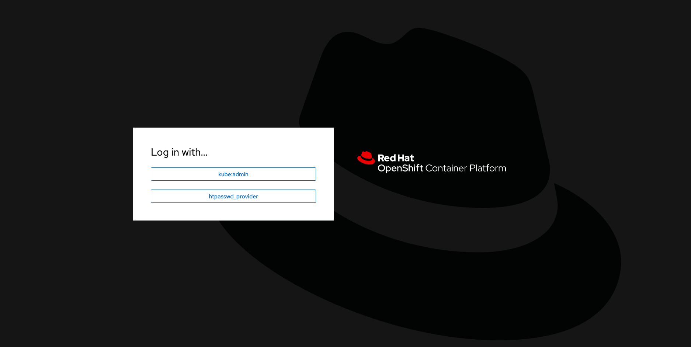
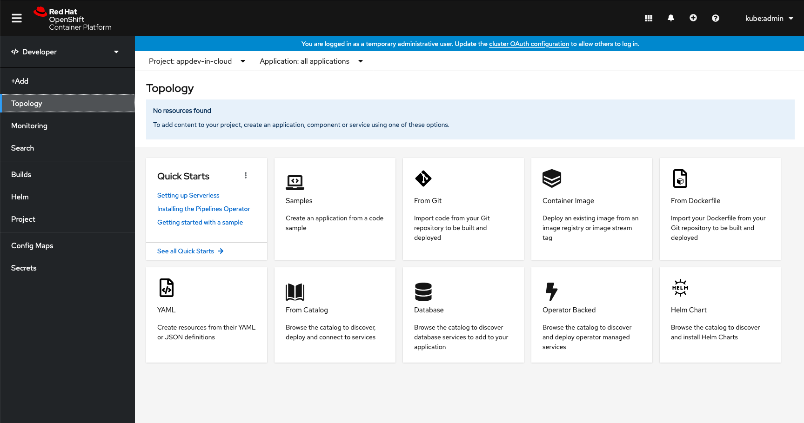

CodeReady Containers Easy Install  
=================================
If you are looking to develop containerized applications, the OpenShift Container Platform (OCP) can help you by providing 
private cloud environment you can install locally. It includes the same container development and run-time 
tools used to create and deploy containers for large data centers. 

CodeReady Containers can be used without this project, but if you want to try a self-contained and reusable container platform
installation on your local machine with OpenShift Container Platform this might just be the project for you. This project 
leverages CodeReady Containers, OpenShift command line tools, and a virtualization tool based on your operating system. You can
start by downloading this project and running as it checks for all needed dependencies when you run the install script. If you're
missing anything, you'll receive pointers to where to find what's needed. Just download the missing component and restart the
install script. Re-running this after an installation is also safe, it's full of checks and verifications that you'll see on the
screen as you run the install script. 

Enjoy your easy to install, local OpenShift Container Platform:

   1. HyperKit for OSX, Hyper-V for Windows, or Libvirt for Linux
   2. CodeReady Containers (OpenShift Container Platform 4.7.0, config is 6 cpu and 16GB ram)
   3. OpenShift Client (oc) v4.7.0

Just download this project, unzip, and run the init.{sh|bat} you need, then follow the instructions on the road
to your very own local container platform installation. 



Try the [video tutorial if you need help.](https://vimeo.com/463766806)


Install on your machine
-----------------------
1. [Download and unzip.](https://gitlab.com/redhatdemocentral/ocp-install-demo/-/archive/main/ocp-install-demo-main.zip)

2. Run 'init.sh' or 'init.bat' file, then sit back. (Note: 'init.bat' should be run with Administrative privileges.)

3. Follow displayed instructions to log in to your brand new OpenShift Container Platform!


Notes
-----
Log in to the OCP console with:
   
   ```
   Admin user: kubeadmin
   Admin pass: [provided-during-installation]

   Developer user:  developer
   Developer pass:  developer
   ```

------

This project has an install script that is setup to allow you to re-run it without worrying about previous
installations. If you re-run it, it removes old setups and reinstalls for you. 

-----


Supporting Articles
-------------------
- [How to setup the OpenShift Container Platform 4.7 on your local machine](https://www.schabell.org/2021/03/codeready-containers-howto-setup-openshift-47-on-local-machine.html)

- [How to setup the OpenShift Container Platform 4.6 on your local machine](https://www.schabell.org/2021/01/codeready-containers-howto-setup-openshift-46-on-local-machine.htmla)

- [CodeReady Containers - Installing business automation operator (Part 4)](https://www.schabell.org/2021/01/codeready-containers-installing.html)

- [CodeReady Containers - Installing business automation operator (Part 3)](https://www.schabell.org/2020/12/codeready-containers-installing-business-automation-operator-part3.html)

- [CodeReady Containers - Installing business automation operator (Part 2)](https://www.schabell.org/2020/12/codeready-containers-installing-business-automation-operator-part2.html) 

- [CodeReady Containers - Installing business automation operator (Part 1)](https://www.schabell.org/2020/12/codeready-containers-installing-business-automation-operator-part1.html) 

- [Video: CodeReady Containers - Easy OpenShift Container Platform 4.5 Installation](https://vimeo.com/463766806)

- [How to setup OpenShift Container Platform 4.5 on your local machine in minutes](https://dzone.com/articles/how-to-setup-openshift-container-platform-45-on-yo)

- [CodeReady Containers - Getting Started with Process Automation in the Cloud](http://www.schabell.org/2019/12/code-ready-containers-getting-started-with-process-automation.html)

- [How to setup OpenShift Container Platform on your local machine in mintues](https://www.schabell.org/2019/11/how-to-setup-openshift-container-platform-in-minutes.html)

- [Cloud Happiness - How to install OpenShift Container Platform with new images and templates in just minute](http://bit.ly/how-to-install-ocp-new-images-and-templates)

- [Free Online Self-Paced Workshop Updated to OpenShift Container Platform 3.7](http://www.schabell.org/2017/12/free-online-self-paced-workshop-updated-openshift-37.html)

- [Cloud Happiness - How to instal new OpenShift Container Platform 3.7 in minutes](http://www.schabell.org/2017/12/cloud-happiness-how-to-install-new-openshift-v37-in-minutes.html) 

- [Windows Hyper-V OpenShift Container Platform Install in Minutes](http://www.schabell.org/2017/11/windows-hyper-v-openshift-container-platform-install-minutes.html)

- [10 Steps to Cloud Happiness: Step 2 - Use a Container Catalog](http://www.schabell.org/2017/10/10-steps-to-cloud-happiness-step-2.html)

- [10 Steps to Cloud Happiness: Step 1 - Get a Cloud](http://www.schabell.org/2017/10/10-steps-to-cloud-happiness-step-1.html)

- [Cloud Happiness - How to install new OpenShift Container Platform 3.6 in just minutes](http://www.schabell.org/2017/08/cloud-happiness-how-to-install-new-openshift-v36-in-minutes.html)

- [Anyone show you how to install OpenShift Container Platform in minutes? (video)](http://www.schabell.org/2017/06/howto-install-openshift-container-platform-in-minutes-video.html)

- [Cloud Happiness - How To Get OpenShift Container Platform v3.5 Installed in Minutes](http://www.schabell.org/2017/05/cloud-happiness-how-to-get-openshift.html)

- [Red Hat Summit - How to setup a container platform for modern application delivery in minutes](http://www.schabell.org/2017/05/redhat-summit-how-to-setup-container-platform-slides.html)

- [Red Hat Summit DevZone - Anyone show you how to install OpenShift Container Platform in minutes?](http://www.schabell.org/2017/05/devzone-how-to-install-openshift-slides.html)

- [Get hands-on with AppDev Cloud free online workshop.](http://appdevcloudworkshop.github.io)

- [Cloud Happiness - OpenShift Container Platform Install on Windows, why wait?](http://www.schabell.org/2017/03/cloud-happiness-openshift-container-platform-windows-install.html)

- [Cloud Happiness - OpenShift Container Platform v3.4 install demo update](http://www.schabell.org/2017/02/cloud-happiness-openshift-container-platform-install-updated.html)

- [Holiday Homework - Red Hat Cloud demo updates](http://www.schabell.org/2016/12/holiday-homework-redhat-cloud-demo-updates.html)

- [3 Steps to Cloud Happiness with OpenShift Container Platform](http://www.schabell.org/2016/11/3-steps-to-cloud-happiness-with-ocp.html)


Released versions
-----------------
See the tagged releases for the following versions of the product:

- v3.7 - CodeReady Containers 1.23.1 using OpenShift command line tools v4.7.0 and OpenShift Container Platform 4.7.0

- v3.6 - CodeReady Containers 1.22.0 using OpenShift command line tools v4.6.15 and OpenShift Container Platform 4.6.15

- v3.5 - CodeReady Containers 1.20.0 using OpenShift command line tools v4.6.6 and OpenShift Container Platform 4.6.6

- v3.4 - CodeReady Containers 1.19.0 using OpenShift command line tools v4.6.3 and OpenShift Container Platform 4.6.3

- v3.3 - CodeReady Containers 1.18.0 using OpenShift command line tools v4.6 and OpenShift Container Platform 4.6.

- v3.2 - CodeReady Containers 1.17.0 using OpenShift command line tools v4.5 and OpenShift Container Platform 4.5.

- v3.1 - CodeReady Containers 1.16.0 using OpenShift command line tools v4.5 and OpenShift Container Platform 4.5.

- v3.0 - CodeReady Containers 1.15.0 using OpenShift command line tools v4.5 and OpenShift Container Platform 4.5.

- v2.9 - CodeReady Containers 1.11.0 using OpenShift command line tools v4.4 and OpenShift Container Platform 4.4.

- v2.8 - CodeReady Containers 1.9.0 using OpenShift command line tools v4.3 and OpenShift Container Platform 4.3.

- v2.7 - CodeReady Containers 1.7.0 using OpenShift command line tools v4.3.

- v2.6 - OpenShift Container Platform v3.9 based on OpenShift command line tools v3.9.14, updated with RHDM 7.1 and RHPAM 7.1 image streams and templates.

- v2.5 - OpenShift Container Platform v3.9 based on OpenShift command line tools v3.9.14, updated image streams and templates to v3.10 feeds.

- v2.4 - OpenShift Container Platform v3.9 based on OpenShift command line tools v3.9.14.

- v2.3 - OpenShift Container Platform v3.7 based on OpenShift command line tools v3.7.9 and added process server templates.

- v2.2 - OpenShift Container Platform v3.7 based on OpenShift command line tools v3.7.9 with Docker dependency removed.

- v2.1 - OpenShift Container Platform v3.7 based on OpenShift command line tools v3.7.9.

- v2.0 - OpenShift Container Platform v3.6 based on OpenShift command line tools v3.6.173 with Hyper-V Windows installation.

- v1.9 - OpenShift Container Platform v3.6 based on OpenShift command line tools v3.6.173 with tech preview service catalog enabled.

- v1.8 - OpenShift Container Platform v3.6 based on OpenShift command line tools v3.6.173 with persistence enabled for restarts.

- v1.7 - OpenShift Container Platform v3.5 based on OpenShift command line tools v3.5.5.5 with persistence enabled for restarts.

- v1.6 - OpenShift Container Platform v3.5 based on OpenShift command line tools v3.5.5.5.

- v1.5 - OpenShift Container Platform v3.4 based on OpenShift command line tools v3.4.1.2-fixed.

- v1.4 - OpenShift Container Platform v3.4 based on OpenShift command line tools v3.4.1.2, added more JBoss product templates.

- v1.3 - OpenShift Container Platform v3.4 based on OpenShift command line tools v3.4.1.2, added Windows installer option.

- v1.2 - OpenShift Container Platform v3.4 based on OpenShift command line tools v3.4.1.2, improved docker validation for Linux.

- v1.1 - OpenShift Container Platform v3.4 based on OpenShift command line tools v3.4.1.2.

- v1.0 - OpenShift Container Platform v3.3 based on OpenShift command line tools v3.3.1.3.

[](https://vimeo.com/463766806)






